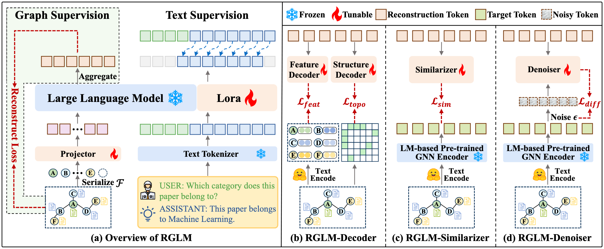

# RGLM

[](https://arxiv.org/abs/2603.01385)
[](https://opensource.org/licenses/MIT)

Official implementation for WWW 2026 paper: "**[Toward Graph-Tokenizing Large Language Models with Reconstructive Graph Instruction Tuning](https://arxiv.org/abs/2603.01385)**"



> **Introduction**: RGLM is a novel alignment pipeline, termed reconstructive graph instruction tuning. The key idea is to reconstruct the graph information from the LLM’s graph token outputs, which are largely ignored in current GTokenLLMs. (a) Overview of RGLM. Given an input TAG, RGLM aims to reconstruct the graph information from the LLM’s graph token outputs, explicitly incorporating graph supervision to constrain the alignment process. (b) RGLM-Decoder variant directly reconstructs the raw node features and topology in the input space. (c) RGLM-Similarizer and (d) RGLM-Denoiser variants reconstruct latent node representations of pre-trained GNNs via the cosine-similarity and denoising strategy, respectively.

## Table of Contents

- [1. Installation](#1-installation)
  - [System Requirements](#system-requirements)
  - [Setup Environment](#setup-environment)
- [2. Code Structure](#2-code-structure)
- [3. Datasets](#3-datasets)
  - [Data Sources](#data-sources)
  - [Dataset Statistics](#dataset-statistics)
- [4. Experiments](#4-experiments)
  - [4.1 Training](#41-training)
  - [4.2 Evaluation](#42-evaluation)
- [5. Hyperparameters](#5-hyperparameters)
- [6. Citation](#6-citation)

## 1. Installation

### System Requirements

- OS: Linux Ubuntu 5.15.0-102-generic
- CPU: Intel(R) Xeon(R) Platinum 8358 CPU @ 2.60GHz
- GPU: NVIDIA A800 80GB


### Setup Environment

Create and activate a conda environment with the required packages:

```bash
# Create conda environment
conda create -n rglm python=3.10
conda activate rglm

# Install dependencies
pip install -r requirements.txt
```

## 2. Code Structure

```
RGLM/
├── assets/
│   └── images/
│       └── RGLM.png                      # framework overview figure
├── checkpoints/                          # saved model checkpoints
├── dataset/
│   ├── cora/                             # Cora raw/processed files
│   ├── pubmed/                           # Pubmed raw/processed files
│   ├── ogbn-arxiv/                       # OGBN-Arxiv raw/processed files
│   ├── reddit/                           # Reddit raw/processed files
│   ├── preprocess.py                     # dataset preprocessing pipeline
│   ├── preprocess_link.py                # link-level preprocessing utilities
│   └── laplacian_2_*.pt                  # precomputed Laplacian tensors
├── model/
│   ├── language_model/
│   │   └── reconglm_llama.py             # LLM backbone integration
│   ├── decoder/
│   │   └── decoder.py                    # RGLM-Decoder implementation
│   ├── similarizer/
│   │   └── similarizer.py                # RGLM-Similarizer implementation
│   ├── denoiser/
│   │   ├── graph_denoiser.py             # RGLM-Denoiser main module
│   │   └── diffusion_utils/              # diffusion process components
│   │       ├── gaussian_diffusion.py
│   │       ├── diffusion_utils.py
│   │       └── respace.py
│   ├── reconglm_arch.py                  # overall RGLM architecture
│   ├── builder.py                        # model construction entry
│   ├── apply_delta.py                    # apply parameter delta
│   ├── make_delta.py                     # build parameter delta
│   └── consolidate.py                    # checkpoint consolidation
├── train/
│   ├── train.py                          # training entry point
│   ├── train_mem.py                      # memory-optimized training
│   ├── reconglm_trainer.py               # custom trainer for RGLM
│   └── llama_flash_attn_monkey_patch.py  # flash-attention patch
├── eval/
│   ├── eval_pretrain.py                  # pretraining-stage evaluation
│   └── eval_res.py                       # result evaluation/reporting
├── scripts/
│   ├── train_decoder.sh                  # train RGLM-Decoder
│   ├── train_similarizer.sh              # train RGLM-Similarizer
│   ├── train_denoiser.sh                 # train RGLM-Denoiser
│   └── eval.sh                           # evaluation script
├── utils/
│   ├── constants.py
│   ├── conversation.py
│   ├── data_process.py
│   └── utils.py
├── requirements.txt
└── REDEME.md
```

Core workflow:
1. Prepare datasets in `dataset/` via preprocessing scripts.
2. Launch variant-specific training with scripts in `scripts/` or `train/train.py`.
3. Load model components from `model/` (decoder/similarizer/denoiser).
4. Evaluate with `eval/` scripts and store artifacts in `checkpoints/`.


## 3. Datasets

### Data Sources
We use the following datasets, all available under MIT license:

- **Cora, Pubmed, OGBN-Arxiv**: [LLaGA Repository](https://github.com/VITA-Group/LLaGA)
- **Reddit**: [GLBench Repository](https://github.com/NineAbyss/GLBench)

For convenience, we provide preprocessed datasets at [dataset](https://drive.google.com/drive/folders/1aPlqxTUjRPUCNlRS-OpaRToEhZb61ffu). Place the downloaded files in the corresponding subdirectories under the `dataset/` directory.

To add your own dataset, first convert it to the LLaGA format ([GLBench_preprocess](https://github.com/NineAbyss/GLBench/blob/main/models/predictor/LLaGA/train/convert_GLBench.py) to build the instruction dataset for node classification, `generate_link_instruction.py` to build the instruction dataset for link prediction), then run `preprocess.py` for node classification, `preprocess_link.py` for link prediction.


### Dataset Statistics

The following table summarizes the datasets used in this project:

| Dataset    | # Nodes | # Edges   | # Class | Splitting | Domain         |
|:------------:|:--------:|:----------:|:--------:|:---------:|:----------------:|
| Cora       |   2,708 |     5,429 |       7 |   6:2:2   | citation       |
| Pubmed     |  19,717 |    44,338 |       3 |   6:2:2   | citation       |
| OGBN-Arxiv | 169,343 | 1,166,243 |      40 |   6:2:3   | citation       |
| Reddit     |  33,434 |   198,448 |       2 |   1:1:8   | social network |

## 4. Experiments

We provide runnable scripts in `scripts/` for training and evaluation.

### 4.1 Training

Before running experiments, activate the environment and move to the project root:

```bash
conda activate rglm
```

Train each variant with:

```bash
# RGLM-Decoder
bash scripts/train_decoder.sh

# RGLM-Similarizer
bash scripts/train_similarizer.sh

# RGLM-Denoiser
bash scripts/train_denoiser.sh
```
The default output checkpoints are saved to:
- `./checkpoints/reconglm_decoder/...`
- `./checkpoints/reconglm_similarizer/...`
- `./checkpoints/reconglm_denoiser/...`

### 4.2 Evaluation

Use the evaluation script with a trained checkpoint path:

```bash
bash scripts/eval.sh /path/to/checkpoint
```

## 5. Hyperparameters
During instruction tuning, we train for one epoch using AdamW with a per-device batch size of 4 and a projector learning rate of 2e-3. Following LLaGA, we upsample the smallest datasets (Cora and Reddit) by replicating their training samples three times to alleviate data imbalance. The warmup ratio is set to 3e-2, the maximum LLM input length is 4096, and for the Neighbor Detail Template we sample 2-hop neighbors with 10 neighbors per hop. During inference, we set the LLM temperature to 0.001 for deterministic and reproducible outputs.

For LoRA fine-tuning, we use the following hyperparameter grid:
- lora_r: 8, 16, 32
- lora_alpha: 2 * lora_r, 4 * lora_r
- lora_dropout: 0.05, 0.1
- learning_rate: 1e-4, 2e-4, 5e-4

For three RGLM variants, the variant-specific search space is:
- RGLM-Decoder: $\lambda_{f}$ in {0.1, 0.2, 0.4, 0.6, 0.8, 1.0}, $\lambda_{s}$ in {1, 2, 4, 6, 8, 10}
- RGLM-Similarizer and RGLM-Denoiser: $\lambda_{l}$ in [0.2, 2.0] with step size 0.2


## 6. Citation

If you find this work useful, please consider starring 🌟 this repo and citing 📑 our paper:

```bibtex
@article{zhang2026rglm,
  title={Toward Graph-Tokenizing Large Language Models with Reconstructive Graph Instruction Tuning},
  author={Zhang, Zhongjian and Wang, Xiao and Zhang, Mengmei and Tan, Jiarui and Shi, Chuan},
  journal={arXiv preprint arXiv:2603.01385},
  year={2026}
}
```